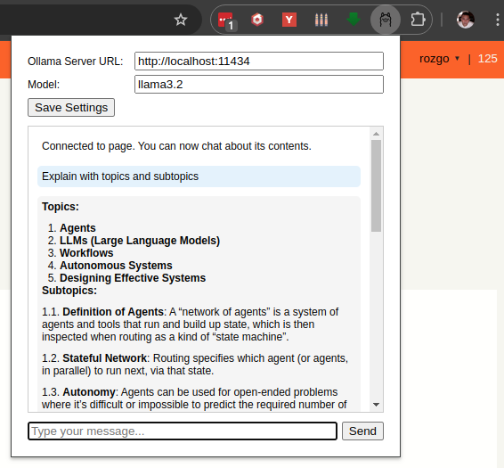

# Ollama Chat Extension

This extension allows you to chat with websites using your local Ollama models.

## Features

-   Chat with websites using Ollama models
-   Customize the model, server URL, and system prompt
-   Save and load settings
-   Automatically loads current website content for contextual chat
-   Chat directly about the webpage you're viewing without any manual setup

## Installing Chrome Extension

1. Clone the repository
2. Load the extension in Chrome by navigating to `chrome://extensions/`, enabling "Developer mode", and clicking "Load unpacked".
3. Pin the extension to the toolbar

## Screenshot

